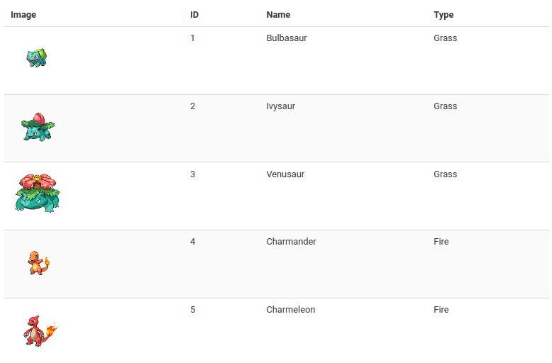

# CASE Front-end starters



This repo features CASE starters with popular front-end frameworks.

The example app is a virtual Pokedex where you can see and create Pokemon.

## How to use ?

First of all launch the CASE backend:

```
cd case
npm i
npm start
```

Once done you can seed the initial list of Pokemon:

```
npm run seed
```

Then `cd` into your favorite front-end and run:

```
npm i
npm start
```

## Dependencies

This project makes use of the following open source libraries and tools:

- [PokeAPI](https://github.com/PokeAPI/pokeapi)
- [Bulma](https://bulma.io)
